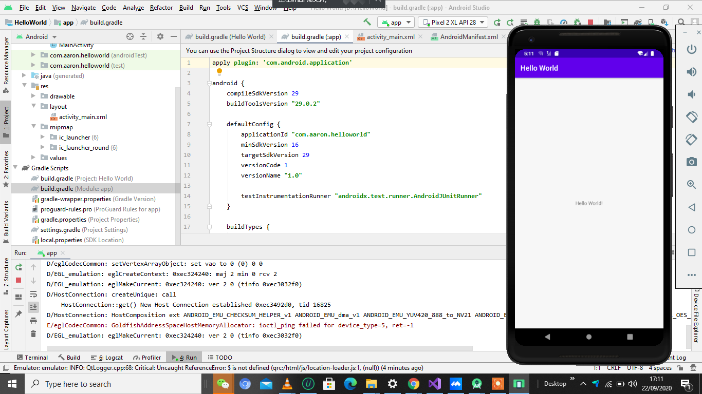
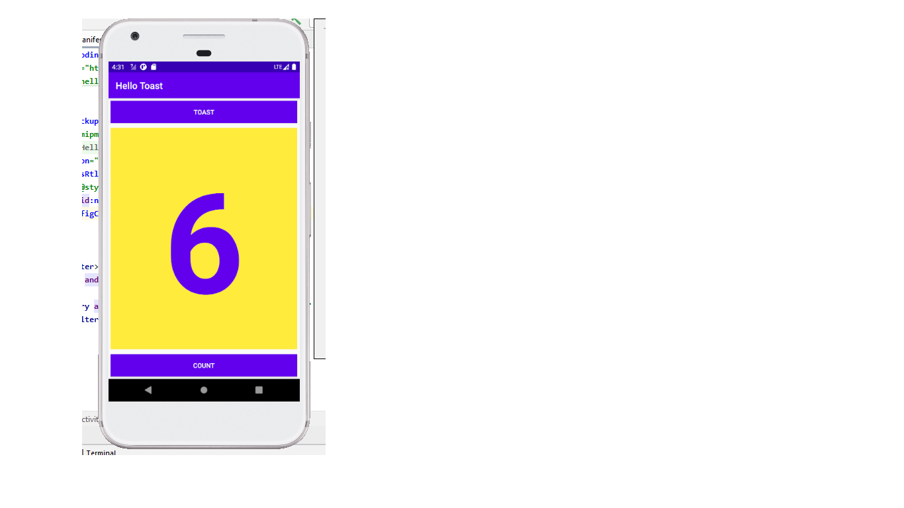
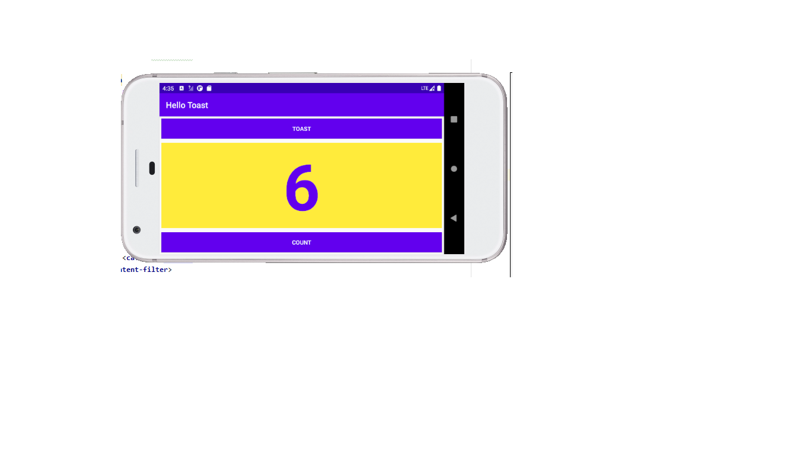
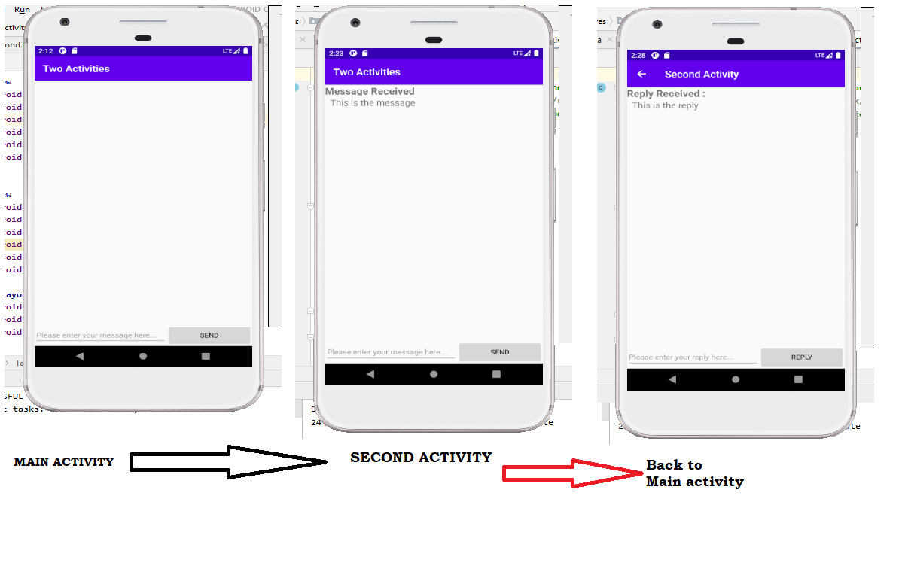
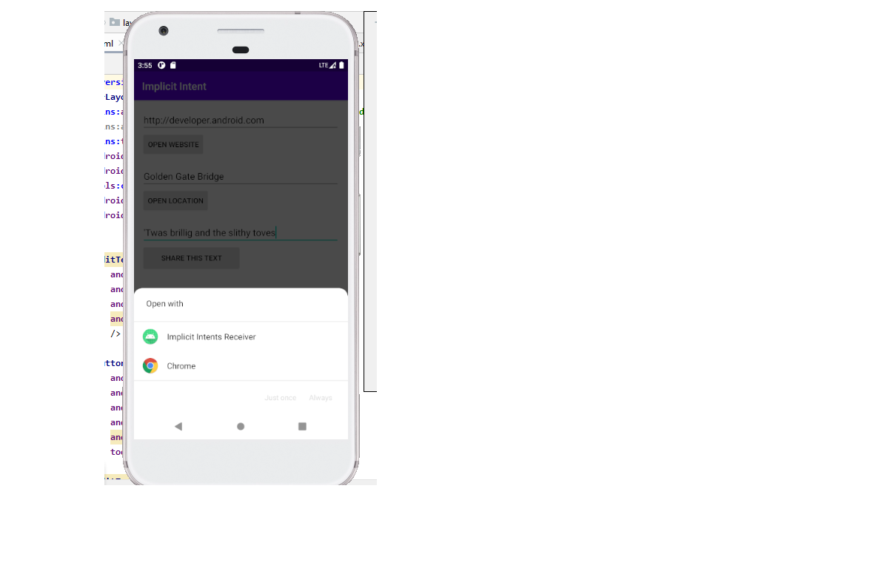

# Codelabs Exrcise

## Week 2. Get started
- [Codelab 1.1: Android Studio and Hello World](https://codelabs.developers.google.com/codelabs/android-training-hello-world/#0)

## Week 3. Layouts and resources for the UI
- [ Part A: Your first interactive UI](https://codelabs.developers.google.com/codelabs/android-training-layout-editor-part-a/)

- [ Part B: The layout editor](https://codelabs.developers.google.com/codelabs/android-training-layout-editor-part-b/)

## Week 4. Activities and intents
- [Codelab 2.1: Activities and intents](https://codelabs.developers.google.com/codelabs/android-training-create-an-activity/index.html) 

## Week 5. Implicit Intents
- [Codelab 2.3: Implicit Intents](https://codelabs.developers.google.com/codelabs/android-training-activity-with-implicit-intent/)

## Week 6. User Interaction
- [Codelab 4.1: Clickable images](https://codelabs.developers.google.com/codelabs/android-training-clickable-images)

- [Codelab 4.2: Input controls](https://codelabs.developers.google.com/codelabs/android-training-input-controls)

## Week 7. User Interaction
- [Codelab 4.4: User navigation](https://codelabs.developers.google.com/codelabs/android-training-provide-user-navigation)

- [Codelab 4.5: RecyclerView](https://codelabs.developers.google.com/codelabs/android-training-create-recycler-view)

## Week 8. Material Design
- [Codelab 5.2: Cards and colors](https://codelabs.developers.google.com/codelabs/android-training-cards-and-colors)

## Week 9. Background Tasks
- [Codelab 7.2: AsyncTask and AsyncTaskLoader](https://developer.android.com/codelabs/android-training-asynctask-asynctaskloader)

## Week 10. Notifications
- [Codelab 8.1: Notifications](https://developer.android.com/codelabs/android-training-notifications)

## Week 11. Shared Preferences
- [Codelab 9.1: Shared Preferences](https://developer.android.com/codelabs/android-training-shared-preferences)

